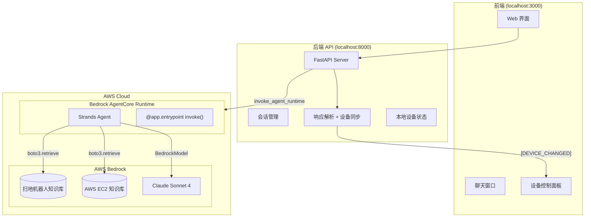
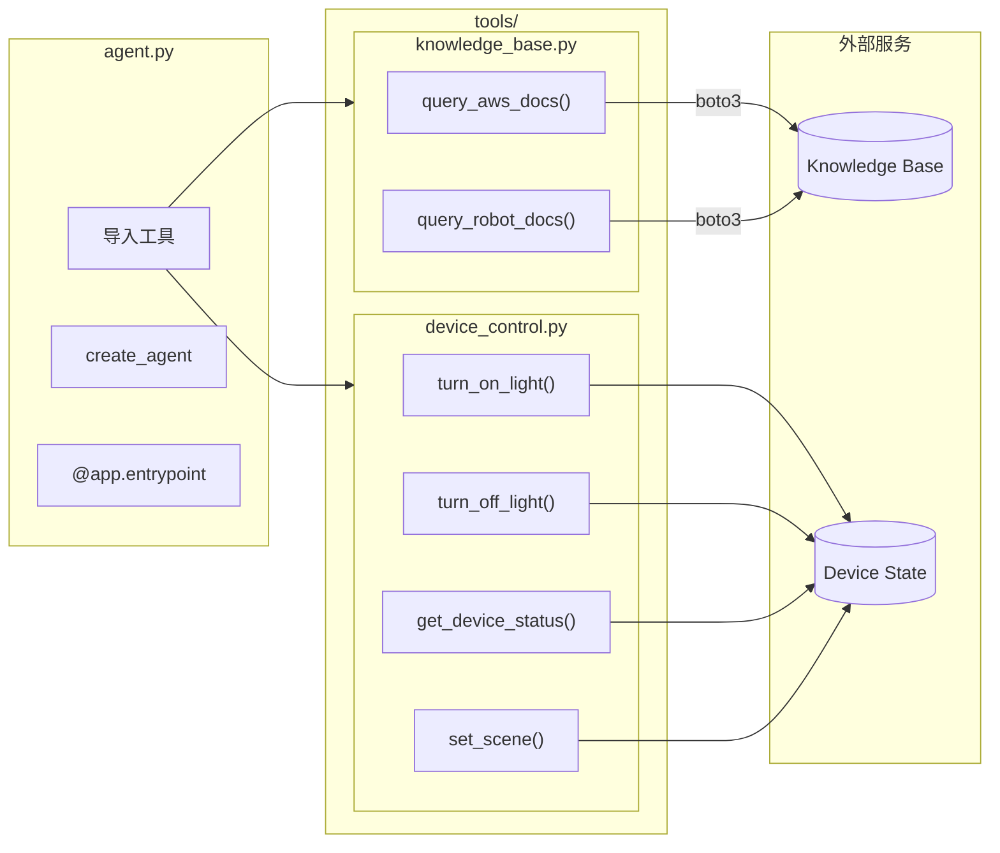
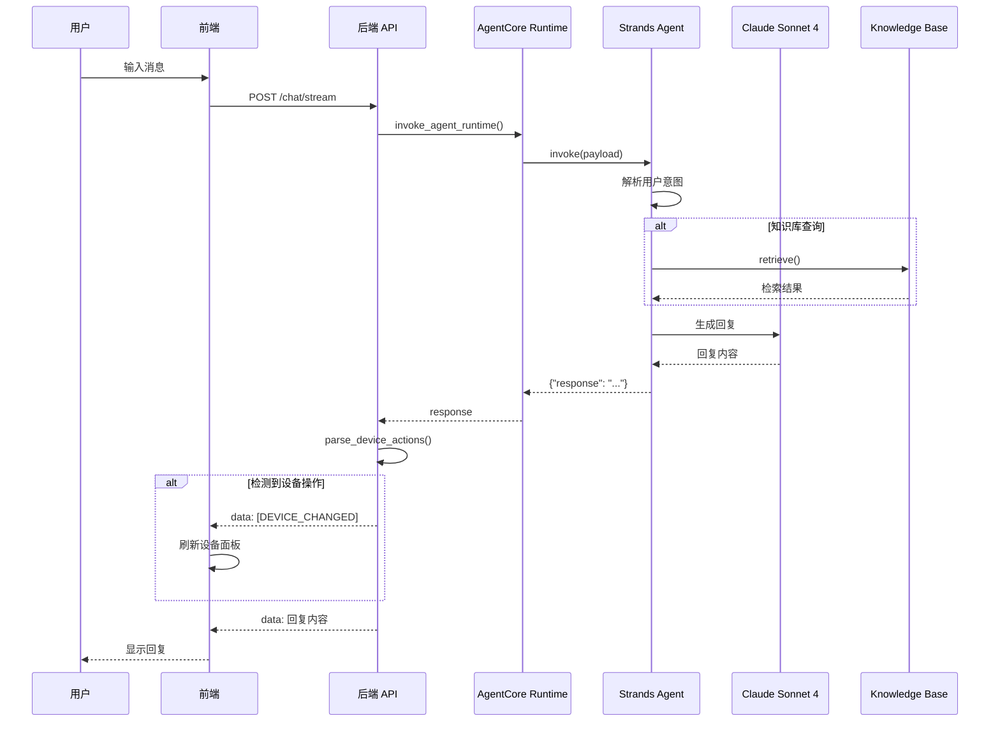
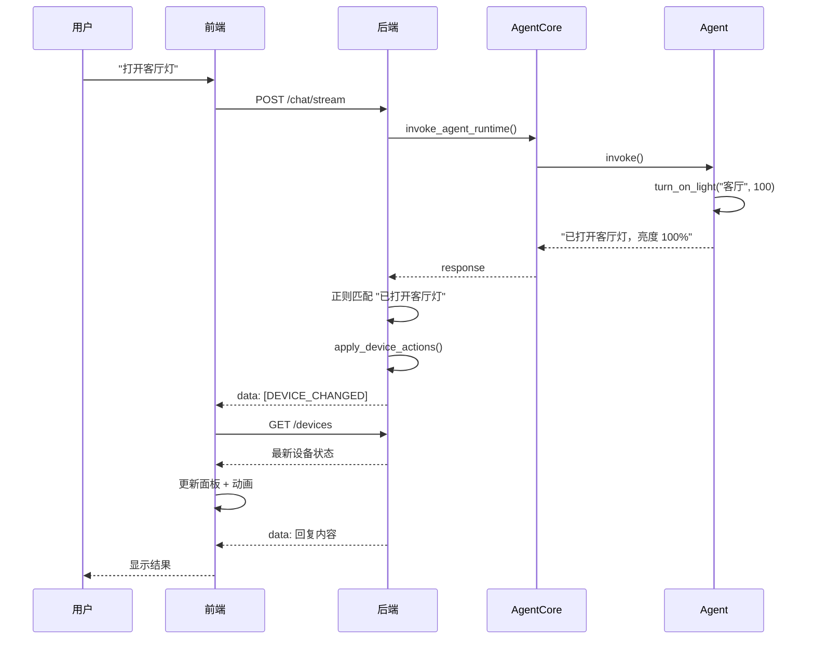
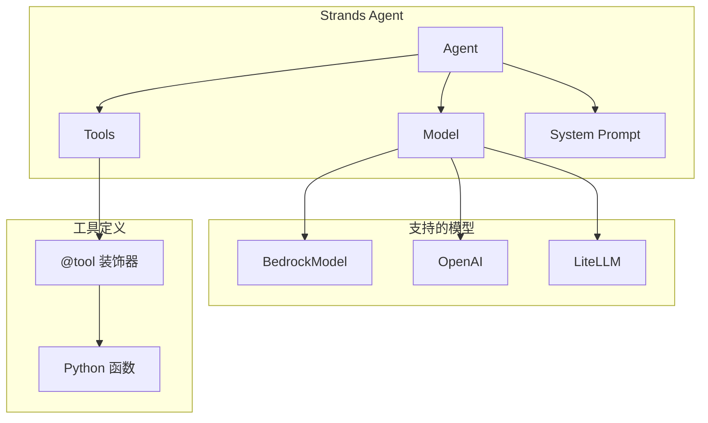
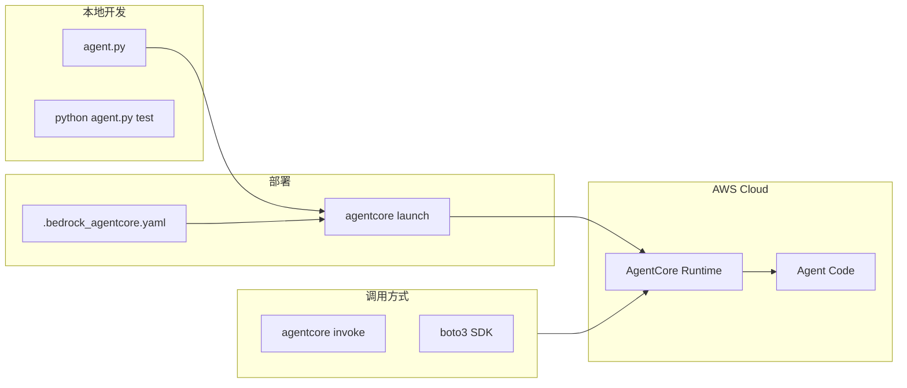

# 智能家居客服系统

基于 **Strands Agent** 构建，部署到 **AWS Bedrock AgentCore Runtime** 的智能客服系统。

## 目录

- [系统架构](#系统架构)
- [调用时序](#调用时序)
- [Strands Agent 介绍](#strands-agent-介绍)
- [AgentCore Runtime 介绍](#agentcore-runtime-介绍)
- [项目结构](#项目结构)
- [快速开始](#快速开始)
- [配置说明](#配置说明)
- [API 参考](#api-参考)
- [最佳实践](#最佳实践)

---

## 系统架构

### 整体架构



### Agent 工具架构



---

## 调用时序

### 聊天请求流程



### 设备控制同步



---

## Strands Agent 介绍

### 什么是 Strands Agent

[Strands Agents](https://github.com/strands-agents/strands-agents) 是开源 Python 框架，用于构建 AI Agent。

### 核心概念



### 代码示例

**agent.py（本项目实际代码）：**

```python
from strands import Agent
from strands.models.bedrock import BedrockModel
from bedrock_agentcore.runtime import BedrockAgentCoreApp

from config.settings import settings
from tools.knowledge_base import query_aws_docs, query_robot_docs
from tools.device_control import (
    turn_on_light, turn_off_light, get_device_status, set_scene,
)

SYSTEM_PROMPT = """你是智能家居客服助手。

## 能力
1. 知识查询 - 查询 AWS EC2 或扫地机器人文档
2. 设备控制 - 控制灯光开关、亮度、场景

## 工具
- query_aws_docs: AWS EC2 相关问题
- query_robot_docs: 扫地机器人相关问题
- turn_on_light: 开灯
- turn_off_light: 关灯
- get_device_status: 查看设备状态
- set_scene: 设置场景模式

## 规则
- 用中文回复，简洁友好
- 知识库查询时，严格基于检索结果回答，不编造
- 设备控制后确认执行结果"""

TOOLS = [
    query_aws_docs, query_robot_docs,
    turn_on_light, turn_off_light, get_device_status, set_scene,
]

def create_agent() -> Agent:
    model = BedrockModel(
        model_id=settings.model.model_id,
        region_name=settings.aws.region
    )
    return Agent(model=model, tools=TOOLS, system_prompt=SYSTEM_PROMPT)

# AgentCore Runtime
app = BedrockAgentCoreApp()

@app.entrypoint
def invoke(payload: dict, context: dict) -> dict:
    prompt = payload.get("prompt", "你好")
    agent = create_agent()
    result = agent(prompt)
    return {"response": str(result)}
```

### 工具定义示例

**tools/device_control.py：**

```python
from strands import tool
from typing import Literal

@tool
def turn_on_light(location: str, brightness: int = 100) -> str:
    """
    打开指定位置的灯。

    Args:
        location: 灯的位置，如 "客厅"、"卧室"、"厨房"、"浴室"
        brightness: 亮度百分比 (1-100)，默认 100

    Returns:
        操作结果消息
    """
    # 实现逻辑...
    return f"已打开{location}灯，亮度 {brightness}%"

@tool
def set_scene(scene: Literal["日间", "夜间", "阅读", "影院", "全关"]) -> str:
    """
    设置场景模式，一键控制多个灯。

    Args:
        scene: 场景名称
            - 日间: 所有灯开启，亮度 100%
            - 夜间: 只开卧室灯，亮度 30%
            - 阅读: 客厅灯 80%，其他关闭
            - 影院: 所有灯关闭
            - 全关: 关闭所有灯

    Returns:
        场景设置结果
    """
    # 实现逻辑...
    return f"已切换到「{scene}」模式"
```

**tools/knowledge_base.py：**

```python
import boto3
from strands import tool
from config.settings import settings

# 延迟初始化，避免冷启动超时
_bedrock_client = None

def get_bedrock_agent_runtime_client():
    global _bedrock_client
    if _bedrock_client is None:
        _bedrock_client = boto3.client(
            "bedrock-agent-runtime",
            region_name=settings.aws.region,
        )
    return _bedrock_client

@tool
def query_aws_docs(query: str, num_results: int = 5) -> str:
    """
    查询 AWS EC2 相关文档知识库。

    当用户询问 AWS、EC2、云服务器、实例类型、AMI、安全组、VPC 等相关问题时使用此工具。

    Args:
        query: 用户的查询问题
        num_results: 返回的结果数量，默认 5 条

    Returns:
        检索到的 AWS 相关知识内容
    """
    client = get_bedrock_agent_runtime_client()
    response = client.retrieve(
        knowledgeBaseId=settings.knowledge_base.kb_aws,
        retrievalQuery={"text": query},
        retrievalConfiguration={
            "vectorSearchConfiguration": {"numberOfResults": num_results}
        }
    )
    # 格式化结果...
    return formatted_results
```

---

## AgentCore Runtime 介绍

### 什么是 AgentCore Runtime

AWS Bedrock AgentCore Runtime 是托管运行环境，用于部署 Agent 代码。



### 部署配置

**.bedrock_agentcore.yaml（本项目配置）：**

```yaml
default_agent: smart_home_assistant
agents:
  smart_home_assistant:
    name: smart_home_assistant
    entrypoint: agent.py
    deployment_type: direct_code_deploy
    runtime_type: PYTHON_3_13
    platform: linux/arm64
    aws:
      region: us-east-1
      network_configuration:
        network_mode: PUBLIC
      observability:
        enabled: true
    memory:
      mode: NO_MEMORY
```

### 部署命令

```bash
# 首次部署
agentcore launch

# 更新部署（保留 ARN）
agentcore launch -auc

# 强制重建依赖
agentcore launch -frd

# 本地测试模式
python agent.py test

# 查看状态
agentcore status

# 命令行调用
agentcore invoke '{"prompt": "打开客厅灯"}'

# 查看日志
aws logs tail /aws/bedrock-agentcore/runtimes/smart_home_assistant-nBHKspHdLI-DEFAULT --since 1h

# 销毁资源
agentcore destroy
```

### 当前部署信息

| 项目 | 值 |
|------|-----|
| Agent Name | smart_home_assistant |
| Agent ARN | `arn:aws:bedrock-agentcore:us-east-1:671067840733:runtime/smart_home_assistant-nBHKspHdLI` |
| Runtime | PYTHON_3_13 |
| Region | us-east-1 |

---

## 项目结构

```
strands-chatbot/
├── agent.py                      # AgentCore 入口，导入工具并创建 Agent
├── config/
│   ├── __init__.py
│   └── settings.py               # 配置管理（环境变量 + 默认值）
├── tools/
│   ├── __init__.py
│   ├── knowledge_base.py         # 知识库查询工具
│   └── device_control.py         # 设备控制工具
├── backend/
│   └── api.py                    # FastAPI 后端，调用 AgentCore
├── frontend/
│   └── index.html                # Web 界面
├── .bedrock_agentcore.yaml       # AgentCore 部署配置
├── requirements.txt              # Python 依赖
└── README.md
```

### 文件说明

| 文件 | 说明 |
|------|------|
| `agent.py` | 定义 SYSTEM_PROMPT、注册工具、`@app.entrypoint` 入口 |
| `config/settings.py` | 配置类：AWS、模型、知识库 ID |
| `tools/knowledge_base.py` | `query_aws_docs`、`query_robot_docs` 工具 |
| `tools/device_control.py` | `turn_on_light`、`turn_off_light`、`get_device_status`、`set_scene` 工具 |
| `backend/api.py` | 调用 AgentCore、解析响应同步设备状态、REST API |

### 工具清单

| 工具 | 文件 | 功能 |
|------|------|------|
| `query_aws_docs` | knowledge_base.py | 查询 AWS EC2 知识库 |
| `query_robot_docs` | knowledge_base.py | 查询扫地机器人知识库 |
| `turn_on_light` | device_control.py | 开灯（支持亮度调节） |
| `turn_off_light` | device_control.py | 关灯 |
| `get_device_status` | device_control.py | 查询设备状态 |
| `set_scene` | device_control.py | 设置场景模式 |

---

## 快速开始

### 1. 环境准备

```bash
git clone <repo-url>
cd strands-chatbot

python -m venv .venv
source .venv/bin/activate  # Windows: .venv\Scripts\activate

pip install -r requirements.txt
```

**requirements.txt：**

```
strands-agents>=1.29.0
strands-agents-tools>=0.1.0
bedrock-agentcore>=1.4.0
boto3>=1.35.0
pydantic>=2.0.0
```

### 2. 配置 AWS

```bash
aws configure
```

或设置环境变量：

```bash
export AWS_REGION=us-east-1
export AWS_ACCESS_KEY_ID=xxx
export AWS_SECRET_ACCESS_KEY=xxx
```

### 3. 本地测试

```bash
python agent.py test
```

输出：
```
==================================================
本地测试模式
模型: anthropic.claude-sonnet-4-20250514-v1:0
区域: us-east-1
==================================================

你: 打开客厅灯

助手: 已打开客厅灯，亮度 100%
```

### 4. 部署到 AgentCore

```bash
agentcore launch
```

### 5. 启动后端和前端

```bash
# 终端 1
cd backend && python api.py

# 终端 2
cd frontend && python -m http.server 3000
```

### 6. 访问

- 前端: http://localhost:3000
- API: http://localhost:8000
- API 文档: http://localhost:8000/docs

---

## 配置说明

### config/settings.py

```python
@dataclass
class Settings:
    aws: AWSConfig           # region, profile
    model: ModelConfig       # model_id, max_tokens
    knowledge_base: KnowledgeBaseConfig  # kb_aws, kb_robot
    memory: MemoryConfig     # enabled, retention_days
```

### 环境变量

| 变量 | 默认值 | 说明 |
|------|--------|------|
| `AWS_REGION` | us-east-1 | AWS 区域 |
| `MODEL_ID` | anthropic.claude-sonnet-4-20250514-v1:0 | 模型 ID |
| `KNOWLEDGE_BASE_ID_AWS` | KNWHSSCUVT | AWS 知识库 ID |
| `KNOWLEDGE_BASE_ID_ROBOT` | 3KZDG0MTIV | 扫地机器人知识库 ID |

### .env 示例

```env
AWS_REGION=us-east-1
MODEL_ID=anthropic.claude-sonnet-4-20250514-v1:0
KNOWLEDGE_BASE_ID_AWS=KNWHSSCUVT
KNOWLEDGE_BASE_ID_ROBOT=3KZDG0MTIV
```

---

## API 参考

### 聊天

```bash
# 流式聊天
curl -X POST http://localhost:8000/chat/stream \
  -H "Content-Type: application/json" \
  -d '{"user_id": "user_001", "message": "打开客厅灯"}'

# 同步聊天
curl -X POST http://localhost:8000/chat \
  -H "Content-Type: application/json" \
  -d '{"user_id": "user_001", "message": "你好"}'
```

### 设备

```bash
# 获取状态
curl http://localhost:8000/devices

# 开灯
curl -X POST "http://localhost:8000/devices/客厅/on?brightness=80"

# 关灯
curl -X POST http://localhost:8000/devices/客厅/off

# 设置场景
curl -X POST http://localhost:8000/devices/scene/影院
```

### 用户

```bash
# 聊天历史
curl http://localhost:8000/users/user_001/history

# 新建会话
curl -X POST http://localhost:8000/users/user_001/new-session

# 清除记忆
curl -X DELETE http://localhost:8000/users/user_001/memory
```

---

## 最佳实践

### 1. 模块化工具

将工具按功能分离到 `tools/` 目录：

```
tools/
├── knowledge_base.py   # 知识库相关
├── device_control.py   # 设备控制相关
└── __init__.py
```

在 `agent.py` 中导入：

```python
from tools.knowledge_base import query_aws_docs, query_robot_docs
from tools.device_control import turn_on_light, turn_off_light
```

### 2. 延迟初始化

避免冷启动超时：

```python
_client = None

def get_client():
    global _client
    if _client is None:
        _client = boto3.client("bedrock-agent-runtime")
    return _client
```

### 3. 工具 Docstring

清晰的 Docstring 帮助 LLM 理解何时使用工具：

```python
@tool
def query_aws_docs(query: str) -> str:
    """
    查询 AWS EC2 相关文档知识库。

    当用户询问 AWS、EC2、云服务器、实例类型、AMI、安全组、VPC 等相关问题时使用此工具。

    Args:
        query: 用户的查询问题

    Returns:
        检索到的 AWS 相关知识内容
    """
```

### 4. 错误处理

```python
@tool
def query_knowledge_base(query: str) -> str:
    try:
        response = client.retrieve(...)
        results = response.get("retrievalResults", [])

        if not results:
            return "未找到相关信息，请尝试其他关键词"

        return format_results(results)

    except Exception as e:
        return f"查询失败: {str(e)}"
```

### 5. 类型注解

使用 `Literal` 限制参数值：

```python
from typing import Literal

@tool
def set_scene(scene: Literal["日间", "夜间", "阅读", "影院", "全关"]) -> str:
    """设置场景模式"""
```

---

## 故障排查

| 问题 | 原因 | 解决 |
|------|------|------|
| 冷启动超时 | boto3 模块级初始化 | 使用延迟初始化 |
| 工具未被调用 | Docstring 不清晰 | 优化工具描述 |
| 知识库无结果 | KB ID 配置错误 | 检查环境变量 |
| 设备面板不同步 | 响应格式变化 | 更新 `parse_device_actions` 正则 |
| 模块导入失败 | 缺少 `__init__.py` | 添加空 `__init__.py` |

---

## License

MIT
